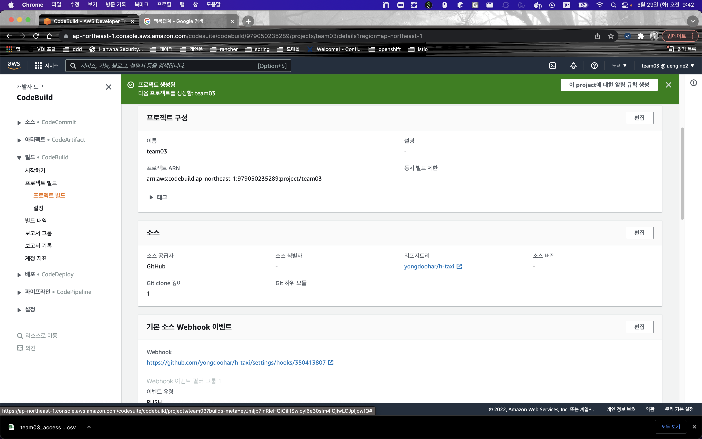
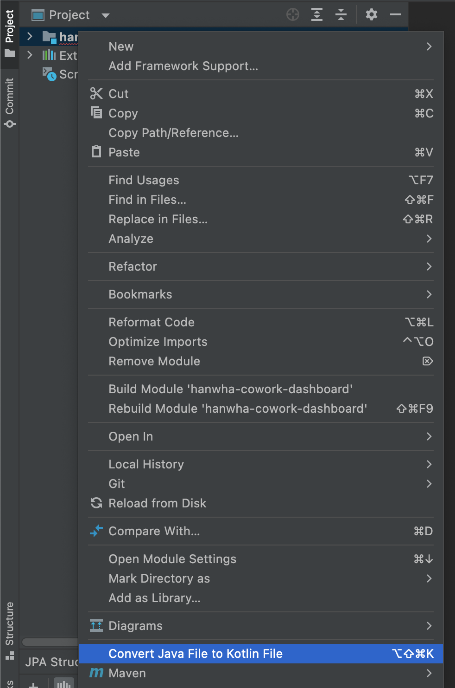

# Deploy

1. deploy 테스트를 위한 k8s pod 생성

```
kubectl apply -f - << EOF
apiVersion: apps/v1
kind: Deployment
metadata:
  name: h-taxi-grap
spec:
  selector:
    matchLabels:
      run: h-taxi-grap
  replicas: 1
  template:
    metadata:
      labels:
        run: h-taxi-grap
    spec:
      containers:
        - name: h-taxi-grap
          image: devgony/h-taxi-grap:stable
          ports:
            - containerPort: 80
          resources:
            limits:
              cpu: 500m
            requests:
              cpu: 200m
---
apiVersion: v1
kind: Service
metadata:
  name: h-taxi-grap
  labels:
    run: h-taxi-grap
spec:
  ports:
    - port: 80
  selector:
    run: h-taxi-grap
EOF
```
2. Service Account 생성
```
cat <<EOF | kubectl apply -f -
apiVersion: v1
kind: ServiceAccount
metadata:
  name: eks-admin
  namespace: kube-system
EOF
```
3. ClusterRoleBinding 생성
```
cat <<EOF | kubectl apply -f -
apiVersion: rbac.authorization.k8s.io/v1beta1
kind: ClusterRoleBinding
metadata:
  name: eks-admin
roleRef:
  apiGroup: rbac.authorization.k8s.io
  kind: ClusterRole
  name: cluster-admin
subjects:
- kind: ServiceAccount
  name: eks-admin
  namespace: kube-system
EOF
```
4. EKS 접속토큰 가져오기
```
kubectl -n kube-system describe secret eks-admin
```
5. buildspec.yml 생성
```
vim buildspec.yml

version: 0.2

env:
  variables:
    _PROJECT_NAME: "h-taxi-grap"

phases:
  install:
    runtime-versions:
      java: corretto8
      docker: 18
    commands:
      - echo install kubectl
      - curl -LO https://storage.googleapis.com/kubernetes-release/release/$(curl -s https://storage.googleapis.com/kubernetes-release/release/stable.txt)/bin/linux/amd64/kubectl
      - chmod +x ./kubectl
      - mv ./kubectl /usr/local/bin/kubectl
  pre_build:
    commands:
      - echo Logging in to Amazon ECR...
      - echo $_PROJECT_NAME
      - echo $AWS_ACCOUNT_ID
      - echo $AWS_DEFAULT_REGION
      - echo $CODEBUILD_RESOLVED_SOURCE_VERSION
      - echo start command
      - $(aws ecr get-login --no-include-email --region $AWS_DEFAULT_REGION)
  build:
    commands:
      - echo Build started on `date`
      - echo Building the Docker image...
      - mvn package -Dmaven.test.skip=true
      - docker build -t $AWS_ACCOUNT_ID.dkr.ecr.$AWS_DEFAULT_REGION.amazonaws.com/$_PROJECT_NAME:$CODEBUILD_RESOLVED_SOURCE_VERSION  .
  post_build:
    commands:
      - echo Pushing the Docker image...
      - docker push $AWS_ACCOUNT_ID.dkr.ecr.$AWS_DEFAULT_REGION.amazonaws.com/$_PROJECT_NAME:$CODEBUILD_RESOLVED_SOURCE_VERSION
      - echo connect kubectl
      - kubectl config set-cluster k8s --server="$KUBE_URL" --insecure-skip-tls-verify=true
      - kubectl config set-credentials admin --token="$KUBE_TOKEN"
      - kubectl config set-context default --cluster=k8s --user=admin
      - kubectl config use-context default
      - |
          cat <<EOF | kubectl apply -f -
          apiVersion: v1
          kind: Service
          metadata:
            name: $_PROJECT_NAME
            labels:
              app: $_PROJECT_NAME
          spec:
            ports:
              - port: 8080
                targetPort: 8080
            selector:
              app: $_PROJECT_NAME
          EOF
      - |
          cat  <<EOF | kubectl apply -f -
          apiVersion: apps/v1
          kind: Deployment
          metadata:
            name: $_PROJECT_NAME
            labels:
              app: $_PROJECT_NAME
          spec:
            replicas: 1
            selector:
              matchLabels:
                app: $_PROJECT_NAME
            template:
              metadata:
                labels:
                  app: $_PROJECT_NAME
              spec:
                containers:
                  - name: $_PROJECT_NAME
                    image: $AWS_ACCOUNT_ID.dkr.ecr.$AWS_DEFAULT_REGION.amazonaws.com/$_PROJECT_NAME:$CODEBUILD_RESOLVED_SOURCE_VERSION
                    ports:
                      - containerPort: 8080
                    readinessProbe:
                      httpGet:
                        path: /actuator/health
                        port: 8080
                      initialDelaySeconds: 10
                      timeoutSeconds: 2
                      periodSeconds: 5
                      failureThreshold: 10
                    livenessProbe:
                      httpGet:
                        path: /actuator/health
                        port: 8080
                      initialDelaySeconds: 120
                      timeoutSeconds: 2
                      periodSeconds: 5
                      failureThreshold: 5
          EOF
cache:
  paths:
    - '/root/.m2/**/*'
```


# Gateway
1. gateway 및 virtualService 생성
```
kubectl apply -f - << EOF
apiVersion: networking.istio.io/v1alpha3
kind: VirtualService
metadata:
  name: h-taxi-grap
spec:
  hosts:
    - "*"
  gateways:
  - h-taxi-grap
  http:
  - match:
    - uri:
        prefix: /h-taxi-grap
    route:
    - destination:
        host: h-taxi-grap
        port:
          number: 8080
EOF
```
```
kubectl apply -f - << EOF
apiVersion: networking.istio.io/v1alpha3
kind: Gateway
metadata:
  name: h-taxi-grap
spec:
  selector:
    istio: ingressgateway # use istio default controller
  servers:
  - port:
      number: 80
      name: http
      protocol: HTTP
    hosts:
    - "*"
EOF
```
- 서비스 호출 및 VirtualService가 정상적으로 서비스 되고 있음을 확인
```
kubectl -n istio-system get service/istio-ingressgateway
NAME                   TYPE           CLUSTER-IP      EXTERNAL-IP                                                                   PORT(S)                                                                      AGE
istio-ingressgateway   LoadBalancer   10.100.31.171   ae4609bc10f1f42998c584fe14ca135e-995907846.ap-northeast-1.elb.amazonaws.com   15021:31779/TCP,80:31137/TCP,443:31132/TCP,31400:32094/TCP,15443:31807/TCP   19m

http http://ae4609bc10f1f42998c584fe14ca135e-995907846.ap-northeast-1.elb.amazonaws.com/h-taxi-grap/actuator/echo

HTTP/1.1 200 OK
content-length: 39
content-type: text/plain;charset=UTF-8
date: Tue, 29 Mar 2022 05:23:14 GMT
server: envoy
x-envoy-upstream-service-time: 215

h-taxi-grap-67ff6476bb-ls9dw/192.168.33.76

```

# Circuit Breaker

1. Circuit Breaker 설치
- DestinationRule 생성
```
kubectl apply -f - << EOF
  apiVersion: networking.istio.io/v1alpha3
  kind: DestinationRule
  metadata:
    name: h-taxi-grap
  spec:
    host: h-taxi-grap
    trafficPolicy:
      outlierDetection:
        consecutive5xxErrors: 1
        interval: 1s
        baseEjectionTime: 3m
        maxEjectionPercent: 100
EOF
```

2. Circuit Breaker 테스트 환경설정
- Replica를 3개로 늘인다.
```
kubectl scale deploy h-taxi-grap --replicas=3
```
- 새 터미널에서 Http Client 컨테이너를 설치하고, 접속한다.
```
kubectl create deploy siege --image=ghcr.io/acmexii/siege-nginx:latest
kubectl exec -it pod/siege-75d5587bf6-fns4p -- /bin/bash
```
3. Circuit Breaker 동작 확인
- 서비스 호출 및 컨테이너가 정상적으로 서비스 되고 있음을 확인
```
root@siege-75d5587bf6-fns4p:/# http http://h-taxi-grap:8080/actuator/echo
HTTP/1.1 200 OK
content-length: 39
content-type: text/plain;charset=UTF-8
date: Tue, 29 Mar 2022 05:23:14 GMT
server: envoy
x-envoy-upstream-service-time: 215

h-taxi-grap-67ff6476bb-ls9dw/192.168.33.76

root@siege-75d5587bf6-fns4p:/# http http://h-taxi-grap:8080/actuator/echo
HTTP/1.1 200 OK
content-length: 40
content-type: text/plain;charset=UTF-8
date: Tue, 29 Mar 2022 05:23:30 GMT
server: envoy
x-envoy-upstream-service-time: 16

h-taxi-grap-67ff6476bb-6rzwc/192.168.82.161

root@siege-75d5587bf6-fns4p:/# http http://h-taxi-grap:8080/actuator/echo
HTTP/1.1 200 OK
content-length: 40
content-type: text/plain;charset=UTF-8
date: Tue, 29 Mar 2022 05:23:31 GMT
server: envoy
x-envoy-upstream-service-time: 25

h-taxi-grap-67ff6476bb-sq452/192.168.12.148

```
- 새로운 터미널에서 마지막에 출력된 h-taxi-grap 컨테이너로 접속하여 명시적으로 5xx 오류를 발생 시킨다.
```
# 새로운 터미널 Open
# 3개 중 하나의 컨테이너에 접속
kubectl exec -it pod/h-taxi-grap-67ff6476bb-ls9dw -c h-taxi-grap -- /bin/sh
#
# httpie 설치 및 서비스 명시적 다운
apk update
apk add httpie
http PUT http://localhost:8080/actuator/down
```
- Siege로 접속한 이전 터미널에서 h-taxi-grap 서비스로 접속해 3회 이상 호출해 본다.
```
http GET http://h-taxi-grap:8080/actuator/health
```
- 아래 URL을 통해 3개 중 2개의 컨테이너만 서비스 됨을 확인한다.
```
root@siege-75d5587bf6-fns4p:/# http http://h-taxi-grap:8080/actuator/echo
HTTP/1.1 200 OK
content-length: 40
content-type: text/plain;charset=UTF-8
date: Tue, 29 Mar 2022 05:28:15 GMT
server: envoy
x-envoy-upstream-service-time: 13

h-taxi-grap-67ff6476bb-6rzwc/192.168.82.161

root@siege-75d5587bf6-fns4p:/# http http://h-taxi-grap:8080/actuator/echo
HTTP/1.1 200 OK
content-length: 40
content-type: text/plain;charset=UTF-8
date: Tue, 29 Mar 2022 05:28:16 GMT
server: envoy
x-envoy-upstream-service-time: 7

h-taxi-grap-67ff6476bb-sq452/192.168.12.148

root@siege-75d5587bf6-fns4p:/# http http://h-taxi-grap:8080/actuator/echo
HTTP/1.1 200 OK
content-length: 40
content-type: text/plain;charset=UTF-8
date: Tue, 29 Mar 2022 05:28:17 GMT
server: envoy
x-envoy-upstream-service-time: 12

h-taxi-grap-67ff6476bb-6rzwc/192.168.82.161

root@siege-75d5587bf6-fns4p:/# http http://h-taxi-grap:8080/actuator/echo
HTTP/1.1 200 OK
content-length: 40
content-type: text/plain;charset=UTF-8
date: Tue, 29 Mar 2022 05:28:19 GMT
server: envoy
x-envoy-upstream-service-time: 11

h-taxi-grap-67ff6476bb-sq452/192.168.12.148
```
- Pool Ejection 타임(3’) 경과후엔 컨테이너 3개가 모두 동작됨이 확인된다.
```
root@siege-75d5587bf6-fns4p:/# http http://h-taxi-grap:8080/actuator/echo
HTTP/1.1 200 OK
content-length: 39
content-type: text/plain;charset=UTF-8
date: Tue, 29 Mar 2022 05:23:14 GMT
server: envoy
x-envoy-upstream-service-time: 215

h-taxi-grap-67ff6476bb-ls9dw/192.168.33.76

root@siege-75d5587bf6-fns4p:/# http http://h-taxi-grap:8080/actuator/echo
HTTP/1.1 200 OK
content-length: 40
content-type: text/plain;charset=UTF-8
date: Tue, 29 Mar 2022 05:23:28 GMT
server: envoy
x-envoy-upstream-service-time: 345

h-taxi-grap-67ff6476bb-6rzwc/192.168.82.161

root@siege-75d5587bf6-fns4p:/# http http://h-taxi-grap:8080/actuator/echo
HTTP/1.1 200 OK
content-length: 40
content-type: text/plain;charset=UTF-8
date: Tue, 29 Mar 2022 05:23:31 GMT
server: envoy
x-envoy-upstream-service-time: 311

h-taxi-grap-67ff6476bb-sq452/192.168.12.148

root@siege-75d5587bf6-fns4p:/# http http://h-taxi-grap:8080/actuator/echo
HTTP/1.1 200 OK
content-length: 39
content-type: text/plain;charset=UTF-8
date: Tue, 29 Mar 2022 05:23:33 GMT
server: envoy
x-envoy-upstream-service-time: 10

h-taxi-grap-67ff6476bb-ls9dw/192.168.33.76
```

# Config Map
1. PVC 생성
```
kubectl apply -f - << EOF
apiVersion: v1
kind: PersistentVolumeClaim
metadata:
  name: fs
  labels:
    app: test-pvc
spec:
  accessModes:
  - ReadWriteOnce
  resources:
    requests:
      storage: 1Mi
EOF
```
2. Secret 객체 생성
```
kubectl apply -f - << EOF
apiVersion: v1
kind: Secret
metadata:
  name: mysql-pass
type: Opaque
data:
  password: YWRtaW4=  
EOF
```

3. 해당 Secret을 h-taxi-grap Deployment에 설정
```
          env:
            - name: superuser.userId
              value: userId
            - name: _DATASOURCE_ADDRESS
              value: mysql
            - name: _DATASOURCE_TABLESPACE
              value: orderdb
            - name: _DATASOURCE_USERNAME
              value: root
            - name: _DATASOURCE_PASSWORD
              valueFrom:
                secretKeyRef:
                  name: mysql-pass
                  key: password
```
4. MySQL 설치
```
kubectl apply -f - << EOF
apiVersion: v1
kind: Pod
metadata:
  name: mysql
  labels:
    name: lbl-k8s-mysql
spec:
  containers:
  - name: mysql
    image: mysql:latest
    env:
    - name: MYSQL_ROOT_PASSWORD
      valueFrom:
        secretKeyRef:
          name: mysql-pass
          key: password
    ports:
    - name: mysql
      containerPort: 3306
      protocol: TCP
    volumeMounts:
    - name: k8s-mysql-storage
      mountPath: /var/lib/mysql
  volumes:
  - name: k8s-mysql-storage
    persistentVolumeClaim:
      claimName: "fs"
EOF

kubectl expose pod mysql --port=3306
```
5. Pod 에 접속하여 h-taxi-db 데이터베이스 공간을 만들어주고 데이터베이스가 잘 동작하는지 확인
```
$ kubectl exec mysql -it -- bash

# echo $MYSQL_ROOT_PASSWORD
admin

# mysql --user=root --password=$MYSQL_ROOT_PASSWORD

mysql> create database orderdb;
    -> ;
Query OK, 1 row affected (0.01 sec)

mysql> show databases;
+--------------------+
| Database           |
+--------------------+
| information_schema |
| mysql              |
| h-taxi-db            |
| performance_schema |
| sys                |
+--------------------+
5 rows in set (0.01 sec)

mysql> exit
```
# Polyglot
1. Java -> Kotlin 변환


2. `deploy` 부분을 동일하게 진행하여 테스트